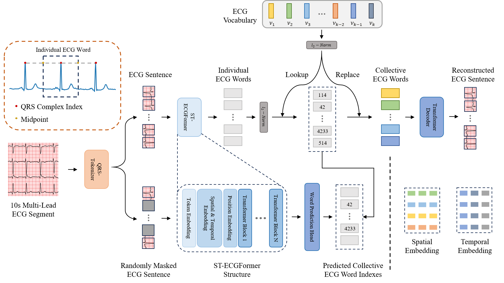

# [ICLR 2025] Reading Your Heart: Learning ECG Words and Sentences via Pre-training ECG Language Model

This is the offical implementation of our ICLR 2025 paper "[Reading Your Heart: Learning ECG Words and Sentences via Pre-training ECG Language Model](https://openreview.net/pdf?id=6Hz1Ko087B)".

> Authors: Jiarui Jin, Haoyu Wang, Hongyan Li, Jun Li, Jiahui Pan, Shenda Hong.



## 🚀 Getting Started

🚩 **News** (Jan 2025): The pre-training checkpoint is now available on [🤗 Hugging Face](https://huggingface.co/PKUDigitalHealth/HeartLang/tree/main)!

🚩 **News** (Jan 2025): The VQ-HBR checkpoint is now available on [🤗 Hugging Face](https://huggingface.co/PKUDigitalHealth/HeartLang/tree/main)!

### Installation

To clone this repository:

```
git clone https://github.com/PKUDigitalHealth/HeartLang.git
```

### Environment Set Up

Install required packages:

```
conda create -n heartlang python=3.9
conda activate heartlang
pip install -r requirements.txt
```

### Prepare Pre-training Data

You can download the electrocardiogram data required for pretraining from [MIMIC-IV Dataset](https://physionet.org/content/mimic-iv-ecg/1.0/).
To preprocess the MIMIC-IV ECG dataset, use the following command:

```
python mimic_preprocess.py --dataset_path <path_to_MIMIC_data> --output_path datasets/ecg_datasets/MIMIC-IV
```

Next, you need to run QRSTokenizer.py to generate ECG sentences from the MIMIC-IV dataset:

```
python QRSTokenizer.py --dataset_name MIMIC-IV
```

### Vector-Quantized Heartbeat Reconstruction Training

The purpose of VQ-HBR is to encode all individual ECG words into collective ECG words. It is recommended to use a platform with 8 NVIDIA GeForce RTX 4090 GPUs.

You can start the VQ-HBR training using the following command:

```
bash scripts/vqhbr/MIMIC-IV.sh
```

Alternatively, you can manually execute the pre-training process with the following command:

```
export OMP_NUM_THREADS=48

# Uncomment and modify the line below to specify visible GPUs
# export CUDA_VISIBLE_DEVICES=0,1,2,3,4,5,6,7

torchrun --nnodes=1 --nproc_per_node=8 run_vqhbr_training.py \
    --output_dir checkpoints/vqhbr/MIMIC-IV/ \
    --log_dir log/vqhbr/MIMIC-IV/ \
    --model vqhbr \
    --codebook_n_emd 8192 \
    --codebook_emd_dim 128 \
    --quantize_kmeans_init \
    --batch_size 64 \
    --opt adamw \
    --opt_betas 0.9 0.99 \
    --weight_decay 1e-4 \
    --warmup_epochs 10 \
    --epochs 100 \
    --save_ckpt_freq 10 \
    --world_size 8 \
    --val_freq 10 \
    --lr 5e-5 \
    --min_lr 1e-5
```

### Masked ECG Sentence Pre-training

In this stage, HeartLang learns generalized rhythm-level representations by masking parts of individual ECG words within an ECG sentence and predicting the corresponding collective ECG words based on the unmasked context.
You can initiate pre-training by running the following script:

```
bash scripts/pretrain/MIMIC-IV.sh
```

Alternatively, you can manually execute the pre-training process with the following command:

```
export OMP_NUM_THREADS=32

# Uncomment and modify the line below to specify visible GPUs
# export CUDA_VISIBLE_DEVICES=0,1,2,3,4,5,6,7

torchrun --nnodes=1 --master_port 49207 --nproc_per_node=8 run_heartlang_pretraining.py \
    --output_dir checkpoints/pretrain/MIMIC-IV \
    --log_dir log/pretrain/MIMIC-IV \
    --model HeartLang \
    --tokenizer_model vqhbr \
    --tokenizer_weight checkpoints/vqhbr/MIMIC-IV/checkpoint-100.pth \
    --batch_size 64 \
    --lr 5e-4 \
    --warmup_epochs 5 \
    --clip_grad 3.0 \
    --layer_scale_init_value 0.1 \
    --opt_betas 0.9 0.98 \
    --opt_eps 1e-8 \
    --epochs 200 \
    --save_ckpt_freq 10 \
    --codebook_size 8192 \
    --codebook_dim 128 \
    --gradient_accumulation_steps 1 \
    --world_size 8
```

In addition to training from scratch, you can also fine-tune downstream tasks using the checkpoints we provide in huggingface. Simply place the downloaded checkpoints into the `checkpoints` folder.

### Fine-tune on Downstream Tasks

In our paper, downstream datasets we used are as follows:

* **PTB-XL**: We downloaded the [PTB-XL](https://physionet.org/content/ptb-xl/1.0.3/) dataset which consisting four Subsets, Superclass, Subclass, Form, Rhythm.
* **CPSC2018**: We used the [CPSC2018](http://2018.icbeb.org/Challenge.html) dataset which consisting three training sets. Since the original link website appears to be no longer available for download, we downloaded the dataset from [OpenDataLab](https://opendatalab.com/OpenDataLab/The_China_Physiological_Signal_etc).
* **CSN(Chapman-Shaoxing-Ningbo)**: We downloaded the [CSN](https://physionet.org/content/ecg-arrhythmia/1.0.0/) dataset.

The data processing code for each downstream dataset is located in the `datasets/dataset_preprocess` directory, while the fine-tuning scripts for different datasets can be found in the `scripts/finetune` directory. Specifically, for the PTB-XL dataset, we adopt the official preprocessing [code](https://github.com/helme/ecg_ptbxl_benchmarking) to obtain the training, validation, and test files.

The following example demonstrates the process using the PTB-XL dataset:

First, create a folder named `PTBXL` under the `datasets/ecg_datasets` directory, and copy and paste all subsets folders into it. At this point, the folder structure will be similar to the following:

```
datasets/
└── ecg_datasets/
    └── PTBXL/
        ├── all/
        ├── diagnostic/
        ├── form/
	├── ...
	├── superdiagnostic/
```

Then, you need to run QRSTokenizer.py to generate ECG sentences from the PTB-XL dataset:

```
python QRSTokenizer.py --dataset_name PTBXL
```

Next, you need to manually copy and paste the label files into the corresponding folders under `PTBXL_QRS`. (It would be even better if we could add this feature to the QRSTokenizer 😀)

```
cp datasets/ecg_datasets/PTBXL/form/*labels* datasets/ecg_datasets/PTBXL_QRS/form
```

Finally, you can initiate the fine-tuning process by running the following script:

```
bash scripts/finetune/PTBXL/12Leads/form/base_form_linear_prob.sh
```

Alternatively, you can manually execute the fine-tuning training process with the following command:

```
torchrun --nnodes=1 --master_port=2025 --nproc_per_node=1 run_class_finetuning.py \
            --dataset_dir datasets/ecg_datasets/PTBXL_QRS/form \
            --output_dir checkpoints/finetune/ptbxl/finetune_form_base_linear_1_random/ \
            --log_dir log/finetune/finetune_form_base_linear_1_random \
            --model HeartLang_finetune_base \
            --finetune checkpoints/heartlang_base/checkpoint-200.pth \
            --trainable linear \
            --split_ratio 1 \
            --sampling_method random \
            --weight_decay 0.05 \
            --batch_size 256 \
            --lr 5e-3 \
            --update_freq 1 \
            --warmup_epochs 10 \
            --epochs 100 \
            --layer_decay 0.9 \
            --save_ckpt_freq 100 \
            --seed 0 \
            --is_binary \
            --nb_classes 19 \
            --world_size 1
```

You can also manually execute the fine-tuning testing process with the following command:

```
torchrun --nnodes=1 --master_port=2025 --nproc_per_node=1 run_class_finetuning.py \
            --dataset_dir datasets/ecg_datasets/PTBXL_QRS/form \
            --output_dir checkpoints/finetune/ptbxl/finetune_form_base_linear_1_random/ \
            --log_dir log/finetune_test/finetune_form_base_linear_1_random \
            --model HeartLang_finetune_base \
            --eval \
            --trainable linear \
            --split_ratio 1 \
            --sampling_method random \
            --batch_size 256 \
            --seed 0 \
            --is_binary \
            --nb_classes 19 \
            --world_size 1
```

For the CPSC2018 and CSN datasets, the fine-tuning training and testing processes are similar and will not be elaborated here.

## References

If you found our work useful in your research, please consider citing our works at:

> ```
> @inproceedings{
> anonymous2024reading,
> title={Reading Your Heart: Learning {ECG} Words and Sentences via Pre-training {ECG} Language Model},
> author={Anonymous},
> booktitle={Submitted to The Thirteenth International Conference on Learning Representations},
> year={2024},
> url={https://openreview.net/forum?id=6Hz1Ko087B},
> note={under review}
> }
> ```
